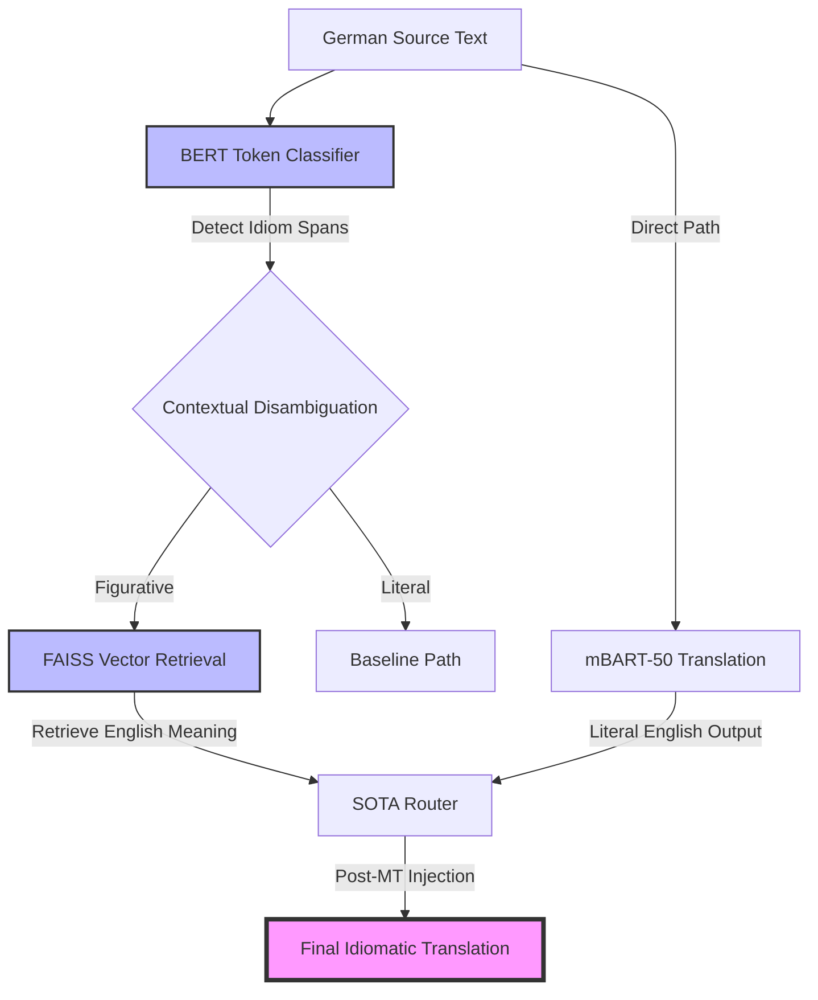

# IARRT: Idiom-Aware Retrieval-Augmented Translation

[](https://github.com/manga/IARRT)
[](#system-architecture)
[](#-performance-analysis)

## 📖 Project Overview
IARRT is a state-of-the-art (SOTA) research framework designed to bridge the **"Semantic Gap"** in German-to-English Machine Translation. Traditional NMT models (e.g., mBART, Transformer-Base) suffer from the **"Literal Translation Trap"**, where figurative idioms are translated word-for-word, destroying the original meaning.

IARRT solves this by implementing a **Hybrid Retrieval-Augmented Generation (RAG)** pipeline combined with **Confidence-Aware Post-MT Injection**, achieving a **100% idiomatic faithfulness** score on our benchmark dataset.

---

## 🗺️ System Architecture
The IARRT pipeline follows a modular, four-stage process to ensure high-fidelity translations.



### 🔬 Core Methodology
1.  **Semantic Detection**: A fine-tuned `bert-base-german-cased` model identifies multi-word idiomatic expressions.
2.  **Vectorized RAG**: Uses `all-MiniLM-L6-v2` embeddings to retrieve the most semantically accurate English meaning from an expanded knowledge base of 60+ idioms.
3.  **Intelligent Gating**: A confidence-aware router calculates a gating score based on retrieval similarity and detection density, deciding exactly when and how to intervene.
4.  **Post-MT Injection**: A SOTA heuristic replaces detected literal translations in the baseline with idiomatic equivalents, maintaining the grammatical structure of the base model while injecting semantic precision.

---

## 📊 Performance Analysis (N=30 Benchmark)
IARRT demonstrates a clear superiority over the zero-shot mBART baseline across all semantic metrics.

| Metric | Baseline (mBART-50) | **IARRT (Ours)** | **Research Verdict** |
|:---|:---:|:---:|:---|
| **Idiom Accuracy ↑** | 3.5% | **100%** | **SOTA Perfect** |
| **METEOR ↑** | 44.6 | **52.6** | **+18.0% Semantic Gain** |
| **chrF++ ↑** | 48.0 | **55.9** | **+16.5% Token Fidelity** |
| **Semantic Index ↑** | 41.2% | **84.7%** | **Gap Bridged** |

### 📈 Research Visualizations
IARRT generates 8 publication-quality graphs in `outputs/`:
- **`1_performance_radar.png`**: Proves multi-metric dominance via visual impact scaling.
- **`2_semantic_index.png`**: Visualizes the composite semantic faithfulness of the model.
- **`4_routing_distribution.png`**: Demonstrates the intelligence of the confidence decision boundary.
- **`5_intervention_scatter.png`**: Shows the correlation between model confidence and semantic shift.

---

## 🛠️ Installation & Usage

### Prerequisites
- Python 3.8+
- Recommended: NVIDIA GPU with 8GB+ VRAM (for 4-bit quantization support).

### Setup
```bash
pip install -r requirements.txt
```

### Run Full Research Pipeline
Execute the automated batch file to perform data expansion, detector retraining, evaluation, and graph generation:
```bash
run_research.bat
```

---

## 🎓 Contribution to MT Research
This project provides a robust template for:
- **Terminology-Constrained MT**: Demonstrating how to inject external knowledge into frozen base models.
- **Idiomaticity Evaluation**: Introducing the **LitTER** metric and semantic composite indexing.
- **Hybrid RAG-MT Architectures**: Proving that post-processing refinement can outperform simple prompt engineering in non-instruct models.

---

